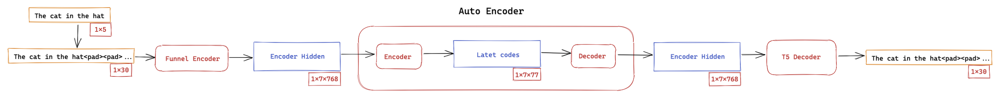
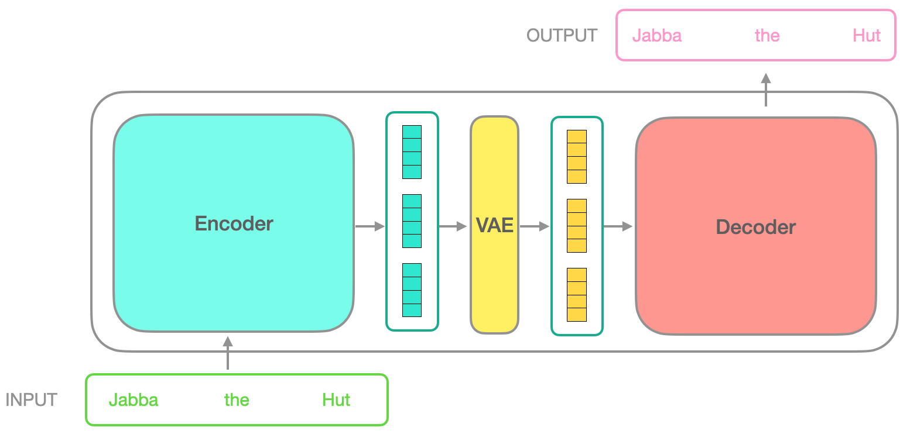
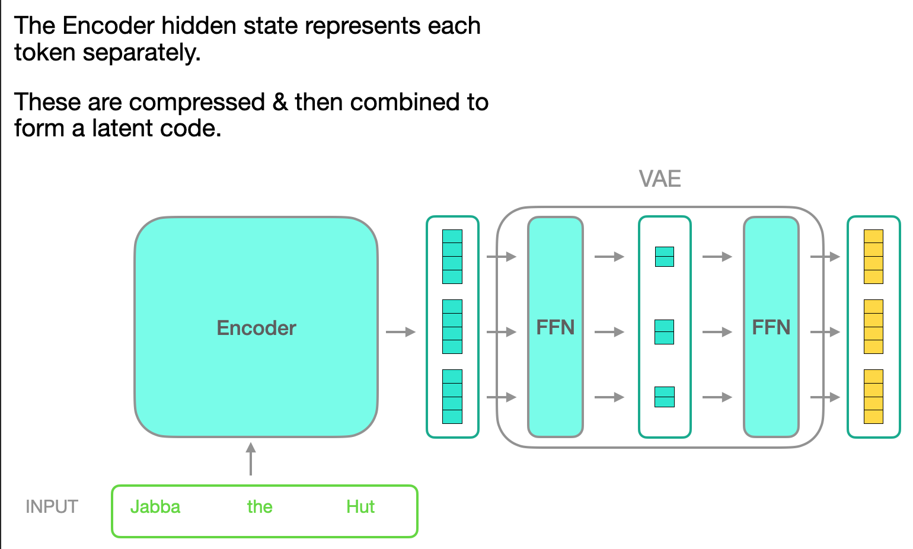
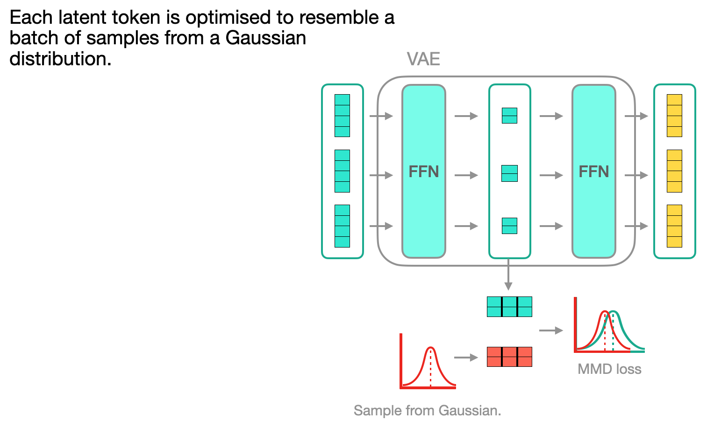

# Transformer-VAE (FLAX)



Transformer-VAE's learn smooth latent spaces of discrete sequences without any explicit rules in their decoders.

This can be used for program synthesis, drug discovery, music generation and much more!

To lean more about how it works checkout [this blog post](http://fras.uk/ml/large%20prior-free%20models/transformer-vae/2020/08/13/Transformers-as-Variational-Autoencoders.html).

If you notice any issues please reach out and open an issue! I'll try to get back to you ASAP.

## How does this work?

Currenlty the takes a transformer encoder and decoder and puts a VAE between them.



The VAE forms a compressed latent code which allows interpolating on the training data.



For regulatisation an MMD loss is used instead of KL Divergence which reduces posterior collapse.



## Install

```bash
git clone https://github.com/Fraser-Greenlee/transformer-vae.git;
cd transformer-vae; python setup.py -q install
```

## Running

The model uses Weights and Biasis for logging. Ensure you have the following enviroment variables set before running:
```bash
WANDB_API_KEY=791c072dd3f0d33aed57e13af6ba86d312cc68c0
WANDB_WATCH=false
WANDB_PROJECT=t-vae_training_demo
```

When running the model will run interpolations and log samples.
Note that this currently doesn't work when using "window attention".

Max run specs (12GB GPU):

* Base model
  * 237seq, 1 batch size
  * 99seq, 7 batch size
  * 30seq, 125 batch size
* Base model (half Funnel 3_3_3)
  * 99seq, 30 batch size
* Base model (tiny Funnel 1_1_1)
  * 237seq 15 batch size
  * 99seq, 40 batch size
* Base model (tiny Funnel 1_1_1) (grad checkpoint every 3 layers)
  * 237seq 30 batch size
* Base model (tiny Funnel 1_1_1) (grad checkpoint every 3 layers + window60)
  * 237seq 50 batch size
* Base model (tiny Funnel 2_2_2) (grad checkpoint every 3 layers + window100-300)
  * 840seq 10 batch size
* Base model (tiny Funnel 1_1_1) (grad checkpoint every layer)
  * 237seq 40 batch size
* Large model,
  * 30seq, 5 batch size


MNIST base (no latent samples):
```bash
cd transformer-vae; python run_experiment.py mnist_base tenth_5_tkn grad_check_pnt batch_small window200 funnel_small
```

MNIST small:
```bash
cd transformer-vae; python run_experiment.py mnist_small tenth_5_tkn batch_small eval
```

Python Lines
```bash
cd transformer-vae; python run_experiment.py syntax tenth_5_tkn batch_large 30Seq eval
```

News Headlines
```bash
cd transformer-vae; python run_experiment.py semantics tenth_5_tkn batch_large 30Seq eval
```
