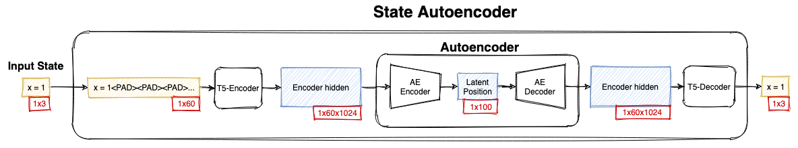

# (WIP) T5-VAE



T5-VAE learns smooth latent spaces of structured sequences without hard-coding rules into the decoder.

This can be used for program synthesis, drug discovery and much more!

To see how it works checkout [this blog post]().

## Training

First get a text file with each line representing a training sample.
The default script uses [Weights & Biasis]() for logging.

Then enter:
```bash
bash train_t5_vae.sh
```

To explore the produced latent space open it using `explore_latent_space.ipynb`.
