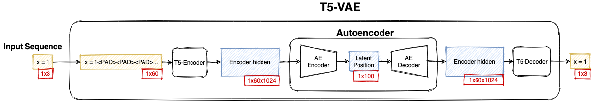

# Transformer-VAE (WIP)



Transformer-VAE's learn smooth latent spaces of discretes sequence without hard-coding rules in their decoders.

This can be used for program synthesis, drug discovery, music generation and much more!

To see how it works checkout [this blog post](https://fraser-greenlee.github.io/2020/08/13/Transformers-as-Variational-Autoencoders.html).

This repo is in active development but I should be coming out with a release soon.

## Install

Install using pip:
```
pip install transformer_vae
```

## Usage

You can exececute the module to easily train it on your own data.
```bash
python -m transformer_vae \
    --project_name="T5-VAE" \
    --output_dir=poet \
    --do_train \
    --huggingface_dataset=poems \
```
Or you can import Transformer-VAE to use as a package much like a Huggingface model.
```python
from transformer_vae import T5_VAE_Model

model = T5_VAE_Model.from_pretrained('t5-vae-poet')
```
## Training
Setup [Weights & Biasis](https://app.wandb.ai/) for logging, see [client](https://github.com/wandb/client).

Get a dataset to model, must be represented with text. This is what we will be interpolating over.

This can be a text file with each line representing a sample.
```bash
python -m transformer_vae \
    --project_name="T5-VAE" \
    --output_dir=poet \
    --do_train \
    --train_file=poems.txt \
```
Alternatively seperate each sample with a line containing only `<|endoftext|>` seperating samples:
```bash
python -m transformer_vae \
    --project_name="T5-VAE" \
    --output_dir=poet \
    --do_train \
    --train_file=poems.txt \
    --multiline_samples
```
Alternatively provide a Huggingface dataset.
```bash
python -m transformer_vae \
    --project_name="T5-VAE" \
    --output_dir=poet \
    --do_train \
    --dataset=poems \
    --content_key text
```

Experiment with different parameters.

Once finished upload to huggingface model hub.

```bash
# TODO
```

Explore the produced latent space using `Colab_T5_VAE.ipynb` or vising this [Colab page](TODO).

### Contributing

Install with tests:
```
pip install -e .[test]
```

Possible contributions to make:
1. Could the docs be more clear? Would it be worth having a docs site/blog?
2. Use a Funnel transformer encoder, is it more efficient?
3. Allow defining alternative tokens set.
4. Store the latent codes from the previous step to use in MMD loss so smaller batch sizes are possible.

Feel free to ask what would be useful!
